### 4. Tools are Structured Outputs

Tools don't need to be complex. At their core, they're just structured output from your LLM that triggers deterministic code. Here's how to keep it simple:

```typescript
// Define your tool types
type DeployTool = {
  intent: "deploy_backend" | "deploy_frontend" | "rollback"
  tag: string
  environment: "staging" | "production"
}

type CheckStatusTool = {
  intent: "check_deployment_status"
  service: string
  timeout?: number
}

type RequestApprovalTool = {
  intent: "request_approval"
  action: string
  details: {
    tag: string
    environment: string
    changes: string[]
  }
}

// Your LLM returns one of these structured types
const nextStep = await determineNextStep(thread)

// Handle the structured output
switch (nextStep.intent) {
  case 'deploy_backend':
    await deployBackend(nextStep.tag, nextStep.environment)
    break
    
  case 'check_deployment_status':
    const status = await checkServiceStatus(nextStep.service)
    break
    
  case 'request_approval':
    await requestHumanApproval(nextStep.details)
    break
}
```

The pattern is simple:
1. LLM outputs structured JSON
2. Deterministic code executes the appropriate action
3. Results are captured and fed back into the context

This creates a clean separation between the LLM's decision-making and your application's actions. The LLM decides what to do, but your code controls how it's done.

#### Example Tool Definitions

Here's how you might define your tools in a more formal way:

```typescript
// Tool definitions
const tools = {
  deploy_backend: {
    description: "Deploy the backend service to a specified environment",
    parameters: {
      tag: {
        type: "string",
        description: "The git tag to deploy"
      },
      environment: {
        type: "string",
        enum: ["staging", "production"],
        description: "The environment to deploy to"
      }
    }
  },
  
  check_deployment_status: {
    description: "Check the status of a deployment or service",
    parameters: {
      service: {
        type: "string",
        description: "The service to check"
      },
      timeout: {
        type: "number",
        description: "Optional timeout in seconds",
        default: 30
      }
    }
  },
  
  request_approval: {
    description: "Request human approval for a deployment",
    parameters: {
      action: {
        type: "string",
        description: "The action requiring approval"
      },
      details: {
        type: "object",
        properties: {
          tag: { type: "string" },
          environment: { type: "string" },
          changes: { 
            type: "array",
            items: { type: "string" }
          }
        }
      }
    }
  }
}
```

#### Benefits of Structured Tools

1. **Type Safety**: Your tools are just TypeScript types, giving you compile-time safety
2. **Documentation**: Tool definitions serve as self-documenting code
3. **Testing**: Structured outputs make it easy to write tests
4. **Error Handling**: Clear structure makes it easier to handle errors

#### Example Usage

Here's how these tools might be used in practice:

```typescript
// The LLM decides to deploy
const nextStep = await determineNextStep(thread)
// {
//   intent: "deploy_backend",
//   tag: "v1.2.3",
//   environment: "production"
// }

// Your code executes
if (nextStep.intent === "deploy_backend") {
  // Request approval for production deployments
  if (nextStep.environment === "production") {
    await requestApproval({
      action: "deploy_backend",
      details: {
        tag: nextStep.tag,
        environment: nextStep.environment,
        changes: ["Updated authentication system", "Fixed database connection"]
      }
    })
  }
  
  // Execute the deployment
  await deployBackend(nextStep.tag, nextStep.environment)
  
  // Check the deployment status
  const status = await checkServiceStatus("backend-service")
  
  // Add results to context
  thread.events.push({
    type: 'deploy_backend_result',
    data: status
  })
}
```

Remember: Tools are just structured data. Keep them simple and let your deterministic code handle the actual execution.

### 5. All state in context window

Many frameworks try to separate "execution state" from "business state", creating complex abstractions to track things like current step, next step, waiting status, retry counts, etc. This separation creates unnecessary complexity.

In reality, you engineer your application so that you can infer all execution state from the context window. The key insight is that execution state (current step, waiting status, etc.) is just metadata about what has happened so far - which is already captured in the event history. There's no need for a separate state management system.

You may have things that can't going in the context window, like session ids, password contexts, etc, but your goal should be to minimize those things.

This approach has several benefits:

1. **Simplicity**: One source of truth for all state
2. **Serialization**: The thread is trivially serializable/deserializable
3. **Debugging**: The entire history is visible in one place
4. **Flexibility**: Easy to add new state by just adding new event types
5. **Recovery**: Can resume from any point by just loading the thread

### 6. Launch/Pause/Resume with simple APIs

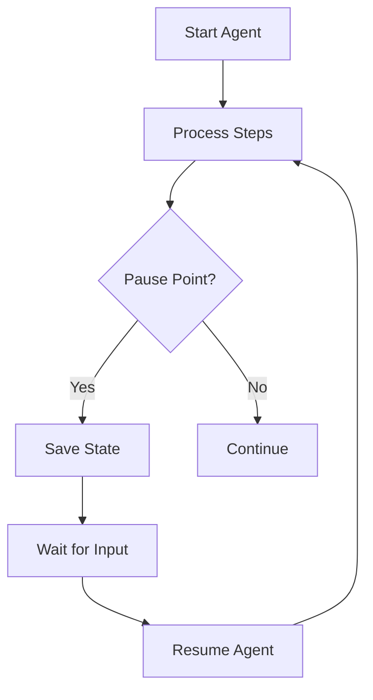

Your agent needs simple, clear APIs for starting new threads, pausing for human input, and resuming later. This is crucial for building production-grade agents that can handle long-running tasks and human interactions.

#### Simple API Design

```typescript
// Start a new agent thread
app.post('/start-agent', async (req: Request, res: Response) => {
  const { input, metadata } = req.body
  const threadId = await startNewThread(input, metadata)
  res.json({ threadId })
})

// Resume after human input
app.post('/resume-agent', async (req: Request, res: Response) => {
  const { threadId, input } = req.body
  await resumeThread(threadId, input)
  res.json({ status: 'resumed' })
})
```

#### Thread State Management

```typescript
interface Thread {
  id: string
  events: Event[]
  metadata: Record<string, any>
}

async function startNewThread(input: string, metadata: Record<string, any>): Promise<string> {
  const thread: Thread = {
    id: generateId(),
    events: [{
      type: 'start',
      data: { input, metadata }
    }],
    metadata
  }
  
  await db.saveThread(thread)
  await handleNextStep(thread) // enter our agent loop
  return thread.id
}

async function resumeThread(threadId: string, input: string): Promise<void> {
  const thread = await db.getThread(threadId)
  thread.events.push({
    type: 'resume',
    data: { input }
  })
  await db.saveThread(thread)
  await handleNextStep(thread)
}
```

#### Processing Loop with Pause Points

```typescript
async function handleNextStep(thread: Thread): Promise<void> {
  while (true) {
    const nextStep = await determineNextStep(thread)
    
    switch (nextStep.intent) {
      case 'kickoff_long_running_pipeline':
        // Pause while waiting for pipeline - this happens within the agent's control flow
        thread.events.push({
          data: { 
            reason: 'pipeline_running',
            pipeline_id: nextStep.pipeline_id,
            expected_duration: nextStep.expected_duration,
            status_url: nextStep.status_url
          }
        })
        const threadID = await db.saveThread(thread)
        //
        await launchPipelineAsync(threadID)
        // exit, we'll get a webhook later to resume
        return
    case '...':
        // ...

}
```

Key benefits of this approach:

1. **Reliability**: Thread state is always saved, so you can recover from crashes
3. **Observability**: Clear status tracking and event history
4. **Flexibility**: Easy to add new pause/resume scenarios
5. **Human Integration**: Natural points for human interaction

Remember: The pause/resume functionality is part of your agent's control flow, not an external API. The agent determines when it needs to pause, and the system provides the infrastructure to support that decision.

### 7. Contact humans with tool calls

### 8. Own your control flow

### 9. Compact Errors into Context Window

### 10. Small, Focused Agents

Rather than building monolithic agents that try to do everything, build small, focused agents that do one thing well. Each agent should have a clear responsibility boundary.

The key insight here is about LLM limitations: the bigger and more complex a task is, the more steps it will take, which means a longer context window. As context grows, LLMs are more likely to get lost or lose focus! By keeping agents focused on specific domains, we keep context windows manageable and LLM performance high.

Our Linear Assistant handles email-based issue management in Linear. It doesn't try to also manage GitHub issues, calendar scheduling, or data analysis. This focus allows it to excel at its specific task.

We learned this lesson the hard way when we initially tried to build a "super agent" that could handle multiple tools and workflows. The agent would frequently confuse which API to use for which task and lose track of multi-step processes. By splitting this into focused agents with clear responsibilities, reliability improved dramatically.

Benefits of small, focused agents:

1. **Manageable Context**: Smaller context windows mean better LLM performance
2. **Clear Responsibilities**: Each agent has a well-defined scope and purpose
3. **Better Reliability**: Less chance of getting lost in complex workflows
4. **Easier Testing**: Simpler to test and validate specific functionality
5. **Improved Debugging**: Easier to identify and fix issues when they occur

Remember: Even as models support longer and longer context windows, you'll ALWAYS get better results with a small, focused prompt and context.

### 11. Trigger from anywhere, meet users where they are

### 12. Make your agent a stateless reducer

Other advice:

- [Factor 13: Pre-fetch all the context you might need](#13-pre-fetch-all-the-context-you-might-need)

### 13. Pre-fetch all the context you might need


## 1. Natural Language → Tool Calls


At the core of our approach is a simple pattern: convert natural language to structured tool calls. Instead of building complex chains of prompts and hoping for the best, we focus on teaching our LLMs to output structured data that our systems can reliably act upon.

```typescript
// The LLM takes natural language and returns a structured tool call
const nextStep = await b.DetermineNextStep("make an issue for austin to stock the fridges")

// Handle the structured output based on its intent
switch (nextStep.intent) {
  case 'create_issue':
    // Code to create an issue
    break;
  case 'request_more_information':
    // Code to ask the user for more info
    break;
}
```

This pattern creates a clean interface between the LLM's reasoning and your application logic. It makes your code more maintainable, easier to test, and simpler to extend with new capabilities. When the LLM's output is structured, you can validate it before execution, preventing many common failure modes.

## 2. Small, Focused Agents

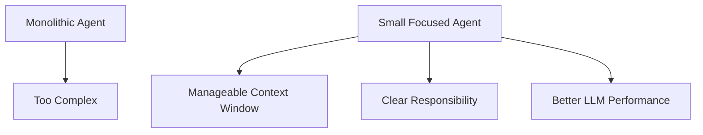

Rather than building monolithic agents that try to do everything, build small, focused agents that do one thing well. Each agent should have a clear responsibility boundary.

The key insight here is about LLM limitations: the bigger and more complex a task is, the more steps it will take, which means a longer context window. As context grows, LLMs are more likely to get lost or lose focus! By keeping agents focused on specific domains, we keep context windows manageable and LLM performance high.

Our Linear Assistant handles email-based issue management in Linear. It doesn't try to also manage GitHub issues, calendar scheduling, or data analysis. This focus allows it to excel at its specific task.

We learned this lesson the hard way when we initially tried to build a "super agent" that could handle multiple tools and workflows. The agent would frequently confuse which API to use for which task and lose track of multi-step processes. By splitting this into focused agents with clear responsibilities, reliability improved dramatically.

Benefits of small, focused agents:

1. **Manageable Context**: Smaller context windows mean better LLM performance
2. **Clear Responsibilities**: Each agent has a well-defined scope and purpose
3. **Better Reliability**: Less chance of getting lost in complex workflows
4. **Easier Testing**: Simpler to test and validate specific functionality
5. **Improved Debugging**: Easier to identify and fix issues when they occur

Remember: Even as models support longer and longer context windows, you'll ALWAYS get better results with a small, focused prompt and context.

## 3. Compact Errors into Context Window

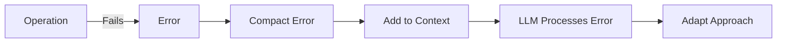

When something goes wrong, don't hide it from your agent. Compact the error information and include it in the context window:

```typescript
try {
  // Operation that might fail
} catch (e) {
  console.error(e)
  thread.events.push({
    type: 'error',
    data: `error running ${thread.events.slice(-1)[0].type}: ${e}`,
  })
  
  // Feed the error back to the LLM
  const nextStep = await b.DetermineNextStep(threadToPrompt(thread))
  // Continue processing with awareness of the error
}
```

This allows your agent to learn from mistakes and adapt its approach in real-time, just like a human would. In practice, this approach has been transformative. When our Linear Assistant encounters an error like "Invalid team ID format," it doesn't just fail – it recognizes the error, lists available teams, and tries again with the correct ID. Users often don't even realize an error occurred because the agent recovered so seamlessly.

## 4. Use Tools for Human Interaction

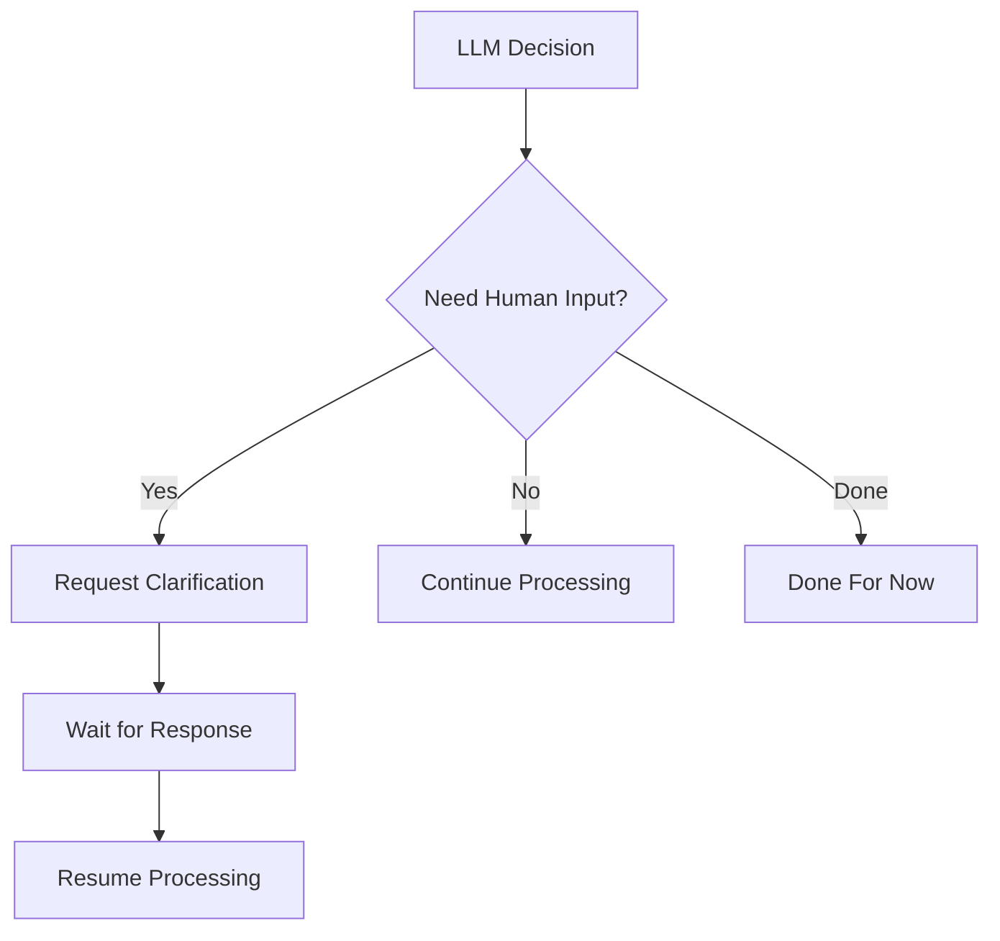

Human interaction should be treated as just another tool call. By modeling human input requests as structured outputs, you create a uniform pattern throughout your codebase:

```typescript
// Tool definitions for human interaction
class RequestClarification {
  intent: "request_clarification"
  question: string
  context: string
}

class DoneForNow {
  intent: "done_for_now"
  message: string
  summary: string
}
```

This approach gives the LLM specific options for how and when to contact humans, with clear structures for what information to include, rather than generic "text OR json" outputs that are common in chat interfaces.

By treating human interaction as a first-class concept in your agent architecture, you make it easier to build systems that know when to operate autonomously and when to involve humans. This creates a more natural collaboration between humans and AI, where each contributes their strengths.

## 5. Tools Are Just Structured Output

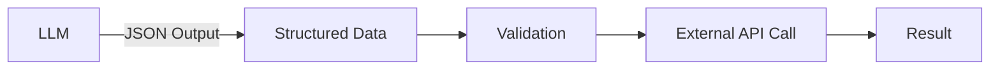

Tools don't need to be complex. At their core, they're just structured output from your LLM that triggers deterministic code:

```baml
class CreateIssue {
  intent: "create_issue"
  issue: {
    title: string
    description: string
    team_id: string
    assignee_id: string
  }
}

class SearchIssues {
  intent: "search_issues"
  query: string
}
```

The pattern is simple:
1. LLM outputs structured JSON
2. Your code validates the structure
3. Deterministic code executes the appropriate action (like calling an external API)
4. Results are captured and fed back into the context

This creates a clean separation between the LLM's decision-making and your application's actions. The LLM decides what to do, but your code controls how it's done. This separation makes your system more reliable and easier to debug when things go wrong.

## 6. Own Your Prompts

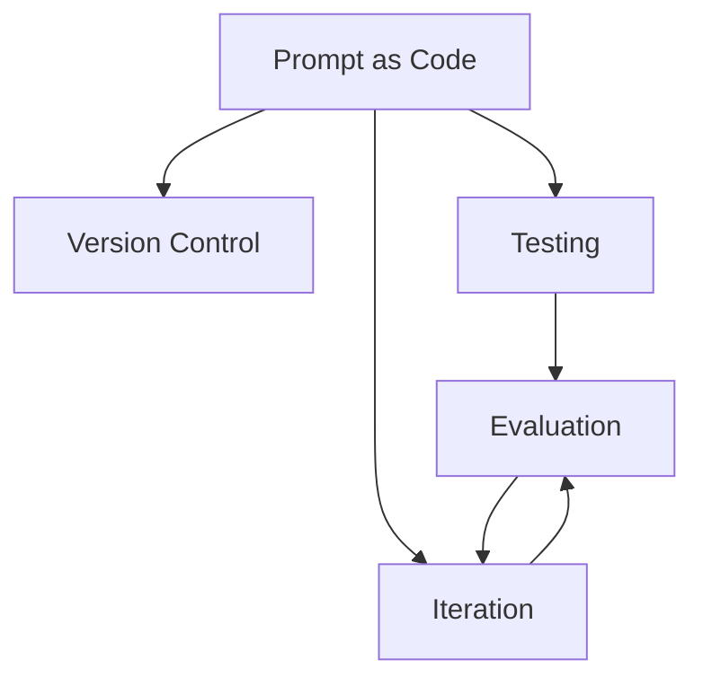

Don't outsource your prompt engineering to a framework. Own your prompts and treat them as first-class citizens in your codebase:

```baml
function DetermineNextStep(thread: string) -> /* various tool types */ {
    client CustomGPT4o

    prompt #"
        {{ _.role("system") }}

        You are a helpful assistant that helps the user with their linear issue management.
        You work hard for whoever sent the inbound initial email, and want to do your best
        to help them do their job by carrying out tasks against the linear api.

        // ... rest of prompt ...

        {{ _.role("user") }}

        // ... user-specific instructions ...

        {{ thread }}

        What should the next step be?

        {{ ctx.output_format }}
    "#
}
```

By maintaining direct control over your prompts, you can:
1. Version control them alongside your code
2. Test them with specific examples
3. Iterate based on real-world performance

Testing is particularly powerful with this approach:

```baml
test TeamIDErrorAsksForMoreInput {
  functions [DetermineNextStep]
  args {
    thread #"
      
          Events:
              <email_received>:
                  {"from_address":"test@example.com","to_address":"support@company.com","subject":"New Ticket","body":"Can you make a new issue for Austin to restock the fridges with tasty beers?","message_id":"test123","previous_thread":[],"raw_email":"raw email content","is_test":null}
              </email_received>
              
      <create_issue> 
                  Title: Restock fridges with tasty beers
                  Description: Austin is requested to restock the fridges with tasty beers.
                  Team ID: team_supply_maintenance
              </create_issue>
              
      <issue_create_result>: 
                  {"errors": [{"message": "Argument Validation Error", "path": ["issueCreate"], "locations": [{"line": 3, "column": 13}], "extensions": {"code": "INVALID_INPUT", "type": "invalid input", "userError": true, "userPresentableMessage": "teamId must be a UUID.", "meta": {}}}], "data: null}"
              </issue_create_result>
              
          
    "#
  }
  @@assert({{this.intent == "list_teams"}})
}
```

This allows you to verify that your agent behaves as expected in specific scenarios. By writing tests for your prompts, you can catch regressions before they affect users and systematically improve your agent's behavior over time.

## 7. Own How You Build Context

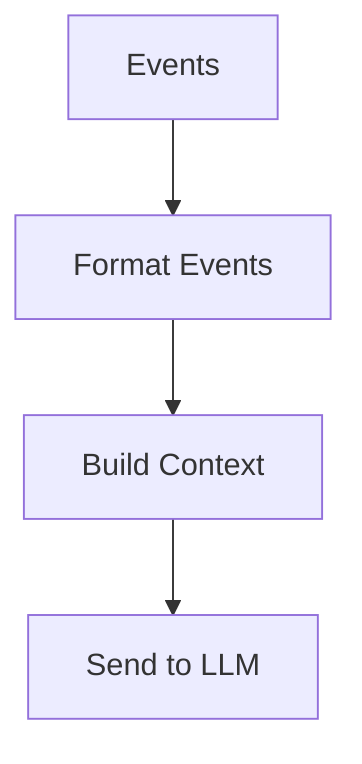

Don't be constrained by the standard message-based context building of most frameworks. Build your context however makes sense for your application.

### Standard OpenAI Message Format

Most frameworks use the OpenAI message format, which, for tool calling, might look like this:

```json
[
  {
    "role": "system",
    "content": "You are a helpful assistant that helps users manage their Linear issues."
  },
  {
    "role": "user",
    "content": "Can you create an issue for Austin to restock the fridges?"
  },
  {
    "role": "assistant",
    "content": null,
    "function_call": {
      "name": "list_teams",
      "arguments": "{}"
    }
  },
  {
    "role": "tool",
    "name": "list_teams",
    "content": "{\"teams\": [{\"id\": \"team-123\", \"name\": \"Operations\", \"members\": [{\"id\": \"user-456\", \"name\": \"Austin\"}]}]}"
  },
  {
    "role": "assistant",
    "content": "I'll create an issue for Austin to restock the fridges in the Operations team."
  }
]
```

This format works well for simple chat applications, but it has limitations for complex agents:
- It's difficult to include structured data
- It's hard to represent tool calls and their results
- It's challenging to maintain context across multiple interactions
- It's not optimized for error handling and recovery

### Custom Context Format

Instead, we can build our own context format that's optimized for our specific use case:

```typescript
const eventToPrompt = (event: Event) => {
  switch (event.type) {
    case 'email_received':
      const email = event.data as EmailPayload
      return `<${event.type}>
            From: ${email.from_address}
            To: ${email.to_address}
            Subject: ${email.subject}
            Body: ${email.body}
            Previous Thread: ${stringifyToYaml(email.previous_thread)}
</${event.type}>
        `
    default:
      const data = typeof event.data !== 'string' ? stringifyToYaml(event.data) : event.data
      return `<${event.type}>
          ${data}
</${event.type}>
      `
  }
}

const threadToPrompt = (thread: Thread) => {
  return thread.events.map(eventToPrompt).join('\n\n')
}
```

This approach gives you complete control over the information density and format of your context window.

### Example Context Windows

Here are some examples of how context windows might look with this approach.

In our case, these just become part of our [single user message](https://github.com/got-agents/agents/blob/main/linear-assistant-ts/baml_src/agent.baml#L28-L58) that we repeatedly pass to the LLM during `DetermineNextStep`.

**Example 1: Initial Email Request**
```
<email_received>
    From: user@example.com
    To: linear-assistant@company.com
    Subject: Create issue for restocking
    Body: Can you please create an issue for Austin to restock the fridges with drinks? It's getting empty.
    Previous Thread: []
</email_received>
```

**Example 2: After Listing Teams**
```
<email_received>
    From: user@example.com
    To: linear-assistant@company.com
    Subject: Create issue for restocking
    Body: Can you please create an issue for Austin to restock the fridges with drinks? It's getting empty.
    Previous Thread: []
</email_received>

<list_teams>
    intent: "list_teams"
</list_teams>

<list_teams_result>
    data:
      teams:
        nodes:
          - id: "team-123"
            name: "Operations"
            members:
              nodes:
                - id: "user-456"
                  name: "Austin"
                - id: "user-789"
                  name: "Sarah"
</list_teams_result>
```

**Example 3: After Error and Recovery**
```
<email_received>
    From: user@example.com
    To: linear-assistant@company.com
    Subject: Create issue for restocking
    Body: Can you please create an issue for Austin to restock the fridges with drinks? It's getting empty.
    Previous Thread: []
</email_received>

<create_issue>
    intent: "create_issue"
    issue:
      title: "Restock fridges with drinks"
      description: "The fridges are getting empty and need to be restocked with drinks."
      team_id: "wrong-id"
      assignee_id: "user-456"
</create_issue>

<error>
    error running create_issue: Invalid team ID format
</error>

<list_teams>
    intent: "list_teams"
</list_teams>

<list_teams_result>
    data:
      teams:
        nodes:
          - id: "team-123"
            name: "Operations"
            members:
              nodes:
                - id: "user-456"
                  name: "Austin"
                - id: "user-789"
                  name: "Sarah"
</list_teams_result>
```

**Example 4: Human Interaction**
```
<email_received>
    From: user@example.com
    To: linear-assistant@company.com
    Subject: Create issue for project
    Body: Can you create an issue for the new project?
    Previous Thread: []
</email_received>

<request_more_information>
    intent: "request_more_information"
    message: "I'd be happy to create an issue for the new project. Could you please provide more details about what the issue should contain? For example, what's the title, description, and who should be assigned to it?"
</request_more_information>

<human_response>
    message: "The issue should be titled 'Set up new marketing project', assigned to Sarah, with description 'Initialize the new Q3 marketing campaign project with initial tasks and timeline'."
</human_response>

<list_users>
    intent: "list_users"
</list_users>

<list_users_result>
    data:
      users:
        nodes:
          - id: "user-789"
            name: "Sarah"
            email: "sarah@company.com"
          - id: "user-456"
            name: "Austin"
            email: "austin@company.com"
</list_users_result>
```

The XML-style format is an arbitrary thing that I happen to like, the point is you can build your own format that makes sense for your application. I don't know what is the best way to pass agentic context windows, but I do know that you'll get better quality if you have the flexibility to experiment.

## 8. Own Your Control Flow

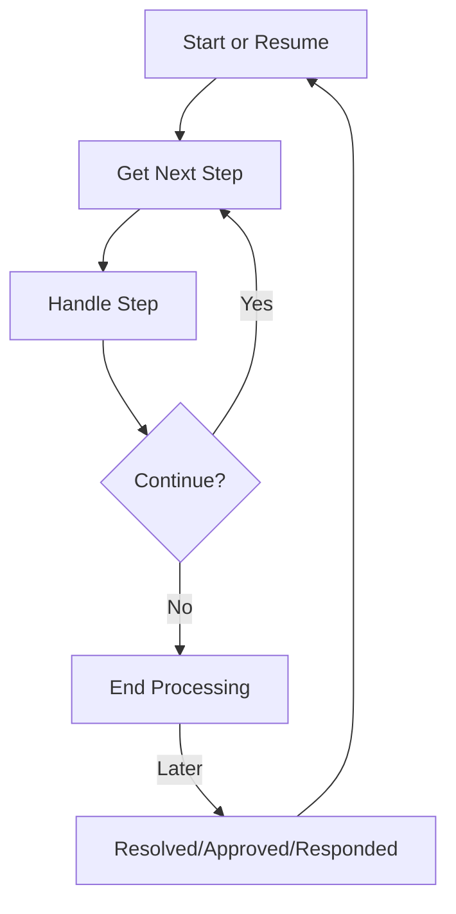

Don't let frameworks dictate your application's flow. Build your own control structures that make sense for your specific use case. Specifically, certain types of tool calls may be reason to break out of the loop and wait for a response from a human or another long-running task like a training pipeline. The below example shows three possible control flow patterns:

- request_clarification: model asked for more info, break the loop and wait for a response from a human
- fetch_open_issues: model asked for a list of open issues, fetch the issues, append to context window, and pass straight back to the model
- create_issue: model asked to create an issue, this is a high-stakes thing, so break the loop and wait for human approval

```typescript
const handleNextStep = async (thread: Thread): Promise<void> => {

  while (true) {
    const nextStep = await b.DetermineNextStep(threadToPrompt(nextThread))
    
    switch (nextStep.intent) {
      case 'request_clarification':
        thread.events.push({
          type: 'request_clarification',
          data: nextStep,
        })

        await sendMessageToHuman(nextStep)
        await db.saveThread(thread)
        // async step - break the loop, we'll get a webhook later
        break
      case 'fetch_open_issues':
        thread.events.push({
          type: 'fetch_open_issues',
          data: nextStep,
        })

        const issues = await linearClient.issues()

        thread.events.push({
          type: 'fetch_open_issues_result',
          data: issues,
        })
        // sync step - pass the new context to the LLM to determine the NEXT next step
        continue
      case 'create_issue':
        thread.events.push({
          type: 'create_issue',
          data: nextStep,
        })

        await requestHumanApproval(nextStep)
        await db.saveThread(thread)
        // async step - break the loop, we'll get a webhook later
        break
      
    }
    
    
  }
}
```

This pattern allows you to interrupt and resume your agent's flow as needed, creating more natural conversations and workflows.

**Example** - the number one feature request I have for every AI framework out there is we need to be able to interrupt 
a working agent and resume later, ESPECIALLY between the moment of tool **selection** and the moment of tool **invocation**.

Without this level of resumability/granularity, there's no way to review/approve the tool call before it runs, which means
you're forced to either:

1. Pause the task in memory (think `while...sleep`) and restart it from the beginning if the process is interrupted.
2. Restrict the agent to only low-stakes, low-risk calls
3. Give the agent access to do bigger, more useful things, and just yolo hope it doesn't screw up

## 9. Simplify with Context Window State

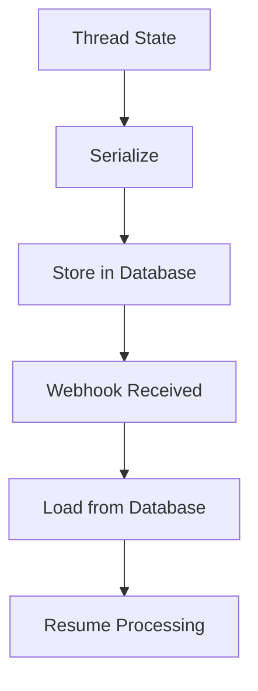

Keep your state management simple by storing all state in a serializable thread object:

```typescript
// Append events to the thread
thread.events.push({
  type: 'create_issue',
  data: nextStep,
})

// Serialize and save state to database
const threadId = await db.saveThread(thread)

// In webhook handler, load state and resume
const handleWebhook = async (req: Request, res: Response) => {
  const { threadId, response } = req.body
  
  // Load thread state from database
  const thread = await db.getThread(threadId)
  
  // Add the human response to the thread
  thread.events.push({
    type: 'human_response',
    data: response,
  })
  
  // Resume processing
  await handleNextStep(thread)
}
```

This approach makes your agent stateless between requests, improving reliability and scalability.

## 10. APIs to Kick Off and Resume Agents

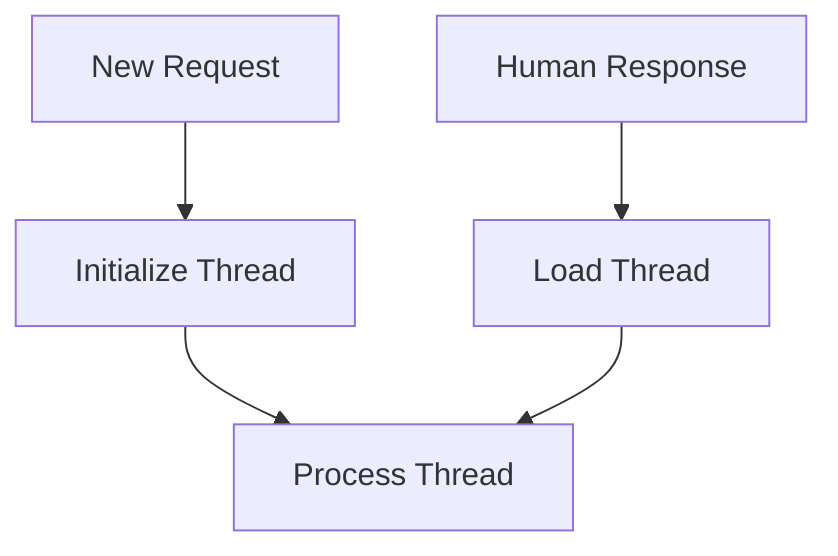

Design clear APIs for starting new agent threads and resuming existing ones:

```typescript

type EmailWebhookPayload = {
  event: {
    from_address: string
    to_address: string
    subject: string
    body: string
    // more fields snipped for brevity
  }
}

app.post('/new-email-thread', async (req: Request, res: Response) => {
  const payload = req.body as EmailWebhookPayload
  await newEmailThreadHandler(payload, res)
})

// New email handler to start a thread
const newEmailThreadHandler = async (payload: EmailWebhookPayload, res: Response) => {
  // Initialize a new thread
  let thread: Thread = {
    initial_email: payload.event,
    events: [
      {
        type: 'email_received',
        data: payload.event,
      },
    ],
  }
  
  // Start processing
  await handleNextStep(thread)
}
```

```typescript

app.post('/resume-email-thread', async (req: Request, res: Response) => {
  const payload = req.body as {
    threadId: string
    response: string
  }
  await handleHumanResponse(payload, res)
})

// Handler for human responses to resume a thread
const handleHumanResponse = async (thread: Thread, response: string): Promise<void> => {
  // Add the human response to the thread
  thread.events.push({
    type: 'human_response',
    data: response,
  })
  
  // Continue processing from where we left off
  await handleNextStep(thread)
}
```

These APIs create clean boundaries for thread lifecycle management.

## 11. Trigger Agents from Anywhere

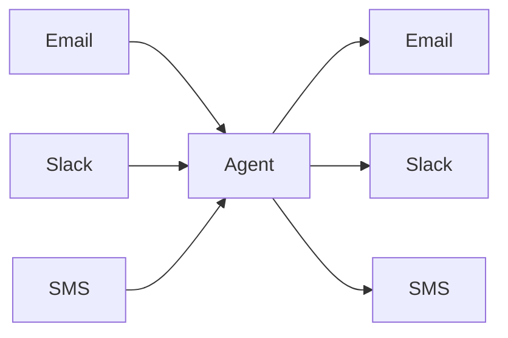

Meet users where they are by designing your agents to be triggered from various channels. This flexibility allows your agents to integrate seamlessly with email, Slack, SMS, or any other communication channel.

The key is to abstract the input and output channels from the core agent logic, allowing the same agent to be triggered from and respond through multiple channels.

## 12. Make Your Agent a Stateless Reducer

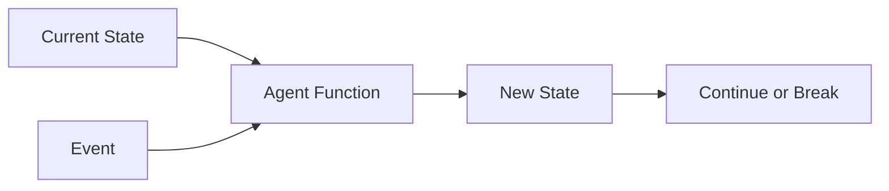

Design your agent as a stateless reducer that takes the current state and an event, then returns a new state:

```typescript
// The agent is a pure function: (state, event) => new state
const _handleNextStep = async (
  thread: Thread,  // Current state
  nextStep: Action,  // Event
): Promise<Thread | false> => {
  // Create a new state based on the current state and event
  switch (nextStep.intent) {
    case 'list_teams':
      thread.events.push({
        type: 'list_teams',
        data: nextStep,
      })
      thread = await appendResult(thread, () => linearClient.teams(), 'teams')
      return thread
    case 'request_clarification':
      thread.events.push({
        type: 'request_clarification',
        data: nextStep,
      })
      // Save state and wait for human input
      await db.saveThread(thread)
      return false
    // ... other cases
  }
}

// The overall pattern is:
// 1. Prompt (DetermineNextStep)
// 2. Switch (handle the intent)
// 3. Loop or Break (continue processing or wait for input)
```

This functional approach makes your agent easier to test, debug, and scale.

## Bringing It All Together

By following these 12 factors, we've built agents that are robust, maintainable, and effective at solving real business problems. The Linear Assistant we've created can:

1. Receive emails requesting Linear issue creation or updates
2. Parse and understand complex natural language requests
3. Take appropriate actions through the Linear API
4. Request human approval for sensitive operations
5. Ask for clarification when needed
6. Maintain context across multiple interactions
7. Respond naturally to users via email

And it does all this through a simple, clear architecture that our team can easily maintain and extend.

## Conclusion

Building agents "the hard way" might seem like more work initially, but the benefits are substantial. You gain complete control over your agent's behavior, eliminating the black-box problems that plague many framework-based approaches.

The 12-Factor Agent methodology creates a clear separation of concerns:
- LLMs handle natural language understanding and decision-making
- Your code handles structured actions and external integrations
- Humans provide oversight and handle edge cases

This separation allows each part of the system to do what it does best, creating agents that are truly useful rather than merely impressive demos.

As we look to the future, we see these principles becoming even more important. As LLM capabilities continue to advance, the bottleneck in agent development will shift from "can the model understand this task?" to "can we build reliable systems around these models?" The teams that master these engineering challenges will be the ones that successfully deploy AI agents that create lasting business value.

Whether you're building customer service agents, internal tools, or complex workflow automation, the 12-Factor approach provides a solid foundation that will scale with both your ambitions and the rapidly evolving capabilities of foundation models.


### The challenge 

My personal challenge is primarily in trying to drive adoption of agent building blocks when most SaaS builders I talk to want to go all in 

I don't think frameworks are the answer, but I also don't think they're the problem. The problem is 

Building agent frameworks is hard. Make them too easy, and they become black boxes you can't customize. Make them too flexible, and why use a framework at all?

We've all been there. The framework gets you to 80% fast. Then you spend weeks digging through abstractions just to get to 85%.

This isn't just agents. It's LLM evals, prompt registries, observability - the whole AI tooling ecosystem. Everyone wants that sweet spot between productivity and flexibility. No one's found it yet.

That's why I'm proposing that we still need to be building agents the hard way. Most YC founders I talk to have been on similar journeys, and opted to pay the cost of building from scratch for the benefit of controlling your own destiny


### Where we go from here

If you made it this far, thanks for reading and hope this was useful or at least thought provoking.

We've got some ideas on where we go from here. Please share your thoughts, what you might be interested to collaborate on, or where else you think the agents ecosystem is headed.

- Building agent frameworks that provide these building blocks, or that provide scaffolding to implement them (think `npx create` for 12-factor agents)
- Putting on an all day hands-on workshop to dive deep on these concepts, perhaps with some other YC founders
- Shipping more OSS agents that demonstrate these concepts, we're all out here learning in the open

What else did I miss? Where can we collab?


### Credits


*Thanks to @vaibhav @jj @meji, Ted Nyman, and Marc Campbell for feedback on early drafts of this article.*

The code referenced uses 

- []
